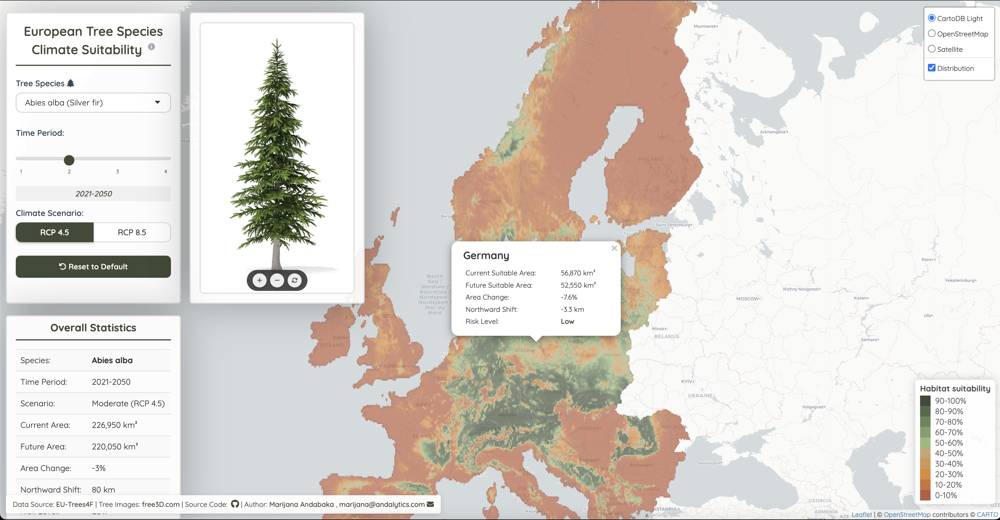

# EU-Trees4F Interactive App

An interactive Shiny application for visualizing European tree species climate suitability based on the EU-Trees4F dataset.





## Overview

This application provides an interactive platform for exploring climate suitability of European tree species across different time periods and climate scenarios. Users can visualize distribution maps, compare climate projections, and analyze country-level statistics for seven major European tree species.

## Features

- Interactive species maps: Visualize habitat suitability across Europe with dynamic color-coded maps
- Climate scenario comparisons: Compare current conditions with future projections under RCP 4.5 and RCP 8.5 scenarios
- Time period analysis: Explore changes across four time periods (1991-2020, 2021-2050, 2051-2080, 2081-2110)
- Country-level statistics: Click on any country to see detailed habitat statistics and risk assessments
- Species information: Interactive tree species images with zoom and pan functionality
- Multiple base maps: Choose between CartoDB Light, OpenStreetMap, and Satellite imagery

## Data Source

This application is based on the EU-Trees4F dataset from the European Commission's Joint Research Centre (JRC):

- **Dataset web page**: [EU-Trees4F - European forest tree distribution under future climate scenarios](https://forest.jrc.ec.europa.eu/en/activities/forests-and-climate-change/){target="_blank"}
- **Citation**: Mauri A., Girardello M., Strona G., Beck P. S. A., Forzieri G., Caudullo G., Manca F. & Cescatti A., 2022. EU-Trees4F, a dataset on the future distribution of European tree species. Scientific Data 9, 37. DOI: [10.1038/s41597-022-01128-5](https://doi.org/10.1038/s41597-022-01128-5){target="_blank"}

## Getting Started

Install the required R packages:

```{r}
install.packages(c(
  "shiny", 
  "leaflet", 
  "raster", 
  "terra", 
  "dplyr", 
  "sf", 
  "rnaturalearth", 
  "rnaturalearthdata", 
  "leaflet.extras", 
  "units", 
  "shinyjs"
))
```


## Data Requirements

**Note**: This application requires the EU-Trees4F raster datasets which are not included in this repository due to size constraints. Please download the required data from the official sources below.

**Download Options:**

- **Complete Dataset** (~2 GB) - All layers: [EU-Trees4F_dataset.zip](link)
- **SDM Ensemble Mean** (~130 MB) - **Recommended**: [EU-Trees4F_ens-sdms.zip](link) 
- **Climatic Ensemble** (~70 MB): [EU-Trees4F_ens-clim.zip](link)
- **Single Models** (~1.2 GB): [EU-Trees4F_single-models.zip](link)
- **PNG Images** (~500 MB): [EU-Trees4F_pngs.zip](link)
- **Individual Species**: Available as separate downloads for each of the 67 species from the [JRC dataset page](https://data.jrc.ec.europa.eu/dataset/b2199de2-2fd8-44aa-9910-2ee9daa5ce93){target="_blank"}

### Alternative Download Sources

- **Figshare**: [Complete dataset](https://figshare.com/articles/dataset/EU-Trees4F_dataset_on_the_future_distribution_of_European_tree_species/14620439){target="_blank"}


### Data Setup Instructions

**Option A: Download complete SDM ensemble** (~130 MB)
1. Download **EU-Trees4F_ens-sdms.zip** 
2. Extract and copy to `Species_Data/` folder

**Option B: Download individual species** (recommended for selective use)
1. **Visit** the [EU-Trees4F dataset page](https://data.jrc.ec.europa.eu/dataset/b2199de2-2fd8-44aa-9910-2ee9daa5ce93){target="_blank"}
2. **Scroll down** to "Layers by species" section
3. **Download SDM ensemble** zip files for each species you need
4. **Extract** each zip file
5. **Create** a `Species_Data/` folder in your project directory
6. **Copy** the extracted species folders following this structure:


Species_Data/
├── EU-Trees4F_Fagus_sylvatica/
│   └── ens_sdms/
│       ├── Fagus_sylvatica_ens-sdms_cur2005_prob_pot.tif
│       ├── Fagus_sylvatica_ens-sdms_rcp45_fut2035_prob_pot.tif
│       └── ...
├── EU-Trees4F_Quercus_robur/
└── ...

### Supported Species in This Application

This application currently supports 7 major European tree species:

| **Latin Name** | **Common Name** |
|----------------|-----------------|
| *Fagus sylvatica* | European beech |
| *Quercus robur* | Pedunculate oak |
| *Quercus petraea* | Sessile oak |
| *Abies alba* | Silver fir |
| *Picea abies* | Norway spruce |
| *Carpinus betulus* | Common hornbeam |
| *Fraxinus excelsior* | Common ash |

The complete EU-Trees4F dataset includes 67 species. This application can be easily extended to include additional species by updating the configuration files.

## Running the Application

```{r}
# Clone the repository
git clone https://github.com/andabaka/EU-Trees4F-App.git

# Navigate to the project directory
setwd("EU-Trees4F-App")

# Run the application
shiny::runApp()
```


## Features in Detail

1. Interactive Map Visualization

- Habitat suitability shown in 10 color-coded categories (0-10% to 90-100%)


2. Climate Scenario Analysis

- Current period: 1991-2020 baseline conditions
- Future scenarios: RCP 4.5 (moderate) and RCP 8.5 (high emission) pathways
- Risk assessment: Automatic categorization into Critical, High, Moderate, and Low risk levels

3.Country Statistics

- Suitable habitat area calculations
- Projected area changes (% increase/decrease)
- Northward distribution shift estimates
- Risk level assessments based on habitat loss projections

## Technical Details

- Built with **R Shiny** framework
- **Leaflet** for interactive mapping
- **`terra`** and **`raster`** packages for spatial data processing p

## Live Demo

Visit the live application: [EU-Trees4F Interactive App](https://mandabaka.shinyapps.io/EU-trees4F-app/){target="_blank"}

## License

This project is licensed under the MIT License - see the LICENSE file for details.

---

**Author:** Marijana Andabaka  
**Website:** [andalytics.com](https://andalytics.com/en/){target="_blank"}  
**Email:** [marijana@andalytics.com](mailto:marijana@andalytics.com)
**LinkedIn**: [marijana-andabaka](https://www.linkedin.com/in/marijana-andabaka/){target="_blank"}
